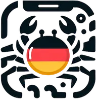

#  Doitsukani ドイツ蟹

[Doitsukani](https://eickler.github.io/doitsukani) is a tool to add German translations to the vocabulary of the [Wanikani](https://wanikani.com) Japanese training app. It is based on EDICT2 files from the [Wadoku project](https://www.wadoku.de/wiki/display/WAD/Downloads+und+Links).

  
  &nbsp;&nbsp;&nbsp;&nbsp;&nbsp;&nbsp;
  

## How can I use it?

- Log in to your Wanikani account and create an API token: [https://www.wanikani.com/settings/personal_access_tokens]. Tick the "study_material:create" and "study_materials:update" boxes.
- Copy the token and paste it into https://eickler.github.io/doitsukani/.
- Click "Add translations" to add German translations, or "Remove translations" to remove them.
- Wait ...

Notes:

- Only vocabulary that is not yet burned is translated.
- The update can take more than one hour if you have not burned anything yet. This is because Wanikani only permits one update per second roughly.
- If you close the browser during the update, the application will simply stop. If you want to continue, just run it again. The application will resume from where it left off.

After everything completed, you should see German translations as "user synonyms" in your Wanikani app as shown in the screenshots.

Limitations:

- There are about 100 vocabulary items that do not have a counterpart in Wadoku.
- Wadoku has a LOT of alternative translations for many words. To not add tens of synonyms, I am using a small heuristic to add up to eight translations as they are.
- The tool currently cannot distinguish between synonyms that were added by the user and synonyms that were added by the app but have been fixed meanwhile. However, I would not like to overwrite synonyms of the user.
